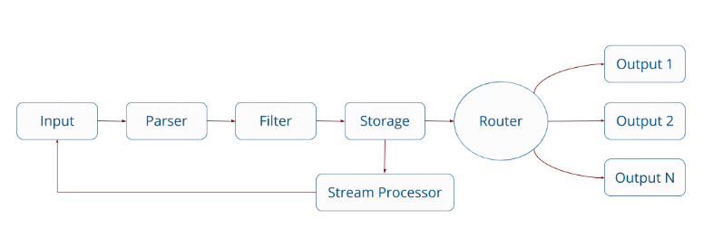

# FluentBit

- パース  
  生の文字列を JSON 形式として解釈する
- タグ付け  
  正規表現やキーの有無によって、ログを分類する
- 変換  
  ログのレコードにフィールド柄削除、値の書き換えを行う。lua スクリプトで独自の変換処理も追加できる
- 出力  
  保存用のサービスなどにログを転送する

## FireLens によっておくられてくるログの形式

AWS FireLens を通してログ出力すると、JSON 形式になり、少なくとも **container_id**、**container_name** およびログの出力元（source が追加される）

enable-ecs-log-metadata を `true` にすると、**ecs_cluster**、**ecs_task_arn**、**ecs_task_definition** の 3 つが追加される（これはデフォルトの動作）

```json
{
  "source": "stdout",
  "log": "アプリケーションが出力したログ",
  "container_id": "コンテナID",
  "container_name": "/コンテナ名",
  "ecs_cluster": "ECSクラスタ名",
  "ecs_task_arn": "ECSタスクのARN",
  "ecs_task_definition": "ECSタスク定義名:リビジョン",
  "e"
}
```

## Fluent Bit の設定

- Dockerfile  
  /fluent-bit/etc/に設定ファイルを設置すると、それらが自動的に使用される  
   なお/fluent-bit/etc/{fluent-bit,fluent}.conf は ECS で予約されているので使えない

---

## 基本

- 含める順序に関わらず、次の順序を尊重する

1. Service
2. Input
3. Filter
4. Output

- flunet-bit_custom.conf には本来 INPUT ディレクティブが必要だが、AWS が提供しているベースの Docker イメージは入力の部分を自動で挿入してくれる。
- 設定ファイルをデバッグするときには、固定値を入力として扱う dummy プラグインや、ファイルを読み込む tail プラグインを使う
- FireLens で集めたログには全て*-firelens-*のタグがついている
- rewrite_tag フィルターは「マッチしてタグを書き換えたレコードをパイプラインに再投入」という動作をする。そのため、Match に指定するパターンは書き換え後のタグがマッチしないように指定しなければならない(「 `Match * `」としない)
- Stream Processor を経たデータは一度ライフサイクルの一番最初に戻る（rewirte_tag フィルタと同じ動き）
- FILTER は上から順番に実行される



---

## SERVICE

このセクションではグローバルなプロパティを定義することが出来ます。ここで定義している Parsers_File には FILTER セクションで使うパーサーファイルのパスを指定します。

| プロパティ | 内容                               |
| ---------- | ---------------------------------- |
| Flush      | 取り込まれたレコードを書き出す間隔 |
| Grace      | 終了までの待機時間                 |
| Log_Level  | ロギングの詳細レベル               |

## INPUT

### tail プラグイン

ファイルへ 1 行 1 レコード、または複数行 1 レコードで書き込まれるログを取り込む際に利用。テキストファイルへの追記を tail -F コマンドに近い動きで検知するほかログファイルのローテーションを検知し、もれなく中身を収集する。

- path で指定されたパターンに該当するファイルをリストアップする。ただし exclude_path のパターンは除外。このリストは refresh_interval の default である 60 秒ごとに更新される
- read_from_head が true に設定されている場合は、ファイルの先頭から読み込む
  | プロパティ | 内容 |
  | - | - |
  | Tag | 読み取った行に配置されるタグ |
  | Key | メッセージが構造化されていないとき(Parser が適用されていないとき)、Key の代替名を定義できる。 |
  | Path | ワイルドカードを使って、特定のログファイルや複数のログファイルを指定できる。コンマで区切られた複数のパターンも可能 |
  | Path_Key | 有効にすると監視対象ファイルの名前がレコードの一部として追加される。 |
  | Exclude_Path | 特定の基準に一致するファイルを除外 |
  | read_from_head | 開始時に新しく検出されたファイルの場合、ファイルの末尾ではなく先頭からコンテンツを読み取る。デフォルトは false |
  | Parser | 構造化メッセージとして解釈するパーサーの指定 |
  | refesh_interval | 監視対象ファイルのリストを更新する間隔。デフォルトは 60s |

- 複数行からなるを読み込むためには、Multiline を On にして、Parser を設定する必要がある
- Parser_Firstline でまず複数行の開始となる行を認識してもらい、継続するログをさらにパースする場合は Parser_N を指定
- 1 つのレコードが複数行に渡るログを読み込むとき、Parser_Firstline で指定されたレコードの開始パターンが見つかるまでレコードの終了位置が定まらない。そのため次のレコードの開始位置が見つかるまでバッファに蓄積され、別プラグインへの転送が行われない。指定した時間で次のログを待たずにログの創出を行うには、multiline_flush オプションを用いる。このオプションで指定した時間、ログの出力がなければそのレコードは終端がきたものとしてパース処理が始まる。

  | プロパティ       | 内容                                                                                                  |
  | ---------------- | ----------------------------------------------------------------------------------------------------- |
  | Multiline        | 複数行のメッセージを検出したい場合は On にする。Parser オプションは使われなくなるので注意。           |
  | Multiline_Flush  | キューに入れられた複数行メッセージを処理するための秒単位の待機時間。デフォルト 4s                     |
  | Parser_Firstline | 複数行メッセージの先頭に一致するパーサーを指定。                                                      |
  | Parser_N         | 複数行メッセージを解析するための、追加のパーサー。N の部分には連番がはいる（Parser_1、Parser_2 など） |

```conf
[INPUT]
    Name tail
    Tag shell-debug.files
    Path /var/www/html/logs/shell-debug.log
    read_from_head on
    Multiline On
    Parser_Firstline multiline_log_1
    refresh_interval 5
```

```conf
[PARSER]
    Name multiline_log_1
    Format regex
    Regex /^(?<logged_at>\d{4}-\d{2}-\d{2} \d{2}:\d{2}:\d{2}) (?<log>.*)/

```

## FILTER

| プロパティ | 内容                                                                                                                     |
| ---------- | ------------------------------------------------------------------------------------------------------------------------ |
| Name       | プラグイン名を指定                                                                                                       |
| Match      | ログに付与されたタグと照合。(大文字と小文字は区別) FireLens は自動でコンテナ名-firelens-コンテナ ID というタグを付与する |

### Parser フィルタ

- json
  json パーサーによって、log の内容を JSON としてパースする.
  Firelens が送ってきたレコード中の log フィールドには JSON であるかに関わりなく生の文字列として格納されている。このパースフィルタにより、ログが JSON 形式であれば log が展開される
  一方 JSON 形式出ない場合は log は展開されず、レコードはそのまま

```conf
[FILTER]
  Name parser
  Match *
  Key_Name log
  Parser json
```

```conf
[PARSER]
  Name json
  Format json
```

- regex

```conf
[FILTER]
  Name parser
  Match *
  Key_Name container_name
  Parser container
  Reserve_Data true

[FILTER]
  Name parser
  Match nginx
  Key_Name log
  Parser nginx
  Preserve_Key true
  Reserve_Data true
```

```conf
# ECSのメタ情報からコンテナ名をパース
[PARSER]
  Name container
  Format regex
  Regex ^\/(?<task_name>(ecs-TaskDefName))-(?<task_revision>\d+)-(?<container_name>.+)-(?<target_name>.+)$

# nginxのアクセスログをパース
[PARSER]
  Name nginx
  Format regex
  Regex ^(?<remote>[^ ]*) (?<host>[^ ]*) (?<user>[^ ]*) \[(?<time>[^\]]*)\] "(?<method>\S+)(?: +(?<path>[^\"]*?)(?: +\S*)?)?" (?<code>[^ ]*) (?<size>[^ ]*)(?: "(?<referer>[^\"]*)" "(?<agent>[^\"]*)") "(?<IPAddress>[^\"]*)"
  Time_Key time
  Time_Format %d/%b/%Y:%H:%M:%S %z
```

| プロパティ   | 内容                                                                                                                         |
| ------------ | ---------------------------------------------------------------------------------------------------------------------------- |
| Key_Name     | パースするログのフィールド名                                                                                                 |
| Preserve_Key | パース後のログにもとの Key_Name フィールドを保持するかどうか。Boolean 値                                                     |
| Reserve_Key  | パース後のレコードに Key_Name 以外のもとのフィールドを保持するかどうか。false を指定すると Key_Name 以外のフィールドは削除。 |

### rewrite_tag フィルタ

rewrite_tag フィルタを使うことで新しいタグでレコードを再発行できる。  
レコードが再発行されると、元のレコードを保存、または破棄できる。

以下のフォーマットでルールを定義

`$KEY REGEX NEW_TAG KEEP`

＊すべてのログを処理するので Match を*にしたいが、*にすると無限ループに陥りログが消滅する。Match には FireLens がふよする*-firelens-*を設定すること

```conf
[FILTER]
  Name rewrite_tag
  Match *-firelens-*
  Rule $container_name ^(nginx)$ combine.nginx false
```

### stream processing

なお 、rewrite_tag フィルターのかわりに stream_process を用いることでも同様の処理を実装できる

```conf
[STREAM_TASK] #Name, Execが必要
  Name nginx
  Exec CREATE STREAM nginx WITH (tag='combine.nginx') AS SELECT * FROM TAG:'*-firelens-*' WHERE container_name = 'nginx';
```

### record_modifier フィルター

必要なキーのみを残したい場合は、「Remove_key」を「Whitelist_key」に変える

```conf
[FILTER]
  Name record_modifier
  Match *
  Remove_key container_id
  Remove_key ecs_cluster
  Remove_key ecs_task_arn
  Remove_key ecs_task_definition
  Remove_key target_name
  Remove_key task_name
```

### grep フィルター

なお、record_modifier でキーを削除する代わりに、grep フィルターの ExcludeKey を用いることも可能

```conf
# ELBのヘルスチェックログを削除
[FILTER]
  Name grep
  Match nginx
  Exclude log ^(?=.*ELB-HealthChecker\/2\.0).*$

```

## STREAM_TASK

[外部リンク](https://fluentbit.io/blog/2020/12/02/supercharge-your-logging-pipeline-with-fluent-bit-stream-processing/)

### ユースケース

1. 単一の場所に送信されるログ量を減らす
   rewrite-tag セクションに記載したのもの

2. バックエンドに送信する前に計算を実行する
   多くの場合、バックエンドシステムは堅牢な集計および計算機能を提供し、保存されているすべてのデータの平均、最小値、および pct95 を決定できるようにします。ただし、S3、Google Cloud Storage、Azure Blob などのオブジェクトストアに送信する場合は、手動で送信する前にこれらの計算を実行することをお勧めします。

3. アプリケーションが大量のメモリを消費する可能性がある場合の時系列予測
   メトリックコレクターとは見なされていませんが、デフォルトのプラグインスイートには、CPU、メモリ、ディスク、およびネットワークのメトリック統計が含まれます。Fluent Bit 1.6 に含まれるより強力なストリーム処理機能の 1 つは、時系列予測です。このストリーム処理により、ユーザーは既存のデータのローリングウィンドウに基づいて時系列メトリックを予測できます

## OUTPUT

### S3

```conf
[OUTPUT]
  Name s3
  Match access-log
  region ${AWS_REGION}
  bucket ${LOG_BUCKET_NAME}
  total_file_size 1M
  upload_timeout 1m
```

| プロパティ      | 内容                                                                                                   |
| --------------- | ------------------------------------------------------------------------------------------------------ |
| total_file_size | S3 のファイルのサイズを指定。最大は 50G、最小は 1M                                                     |
| upload_timeout  | この時間が経過するたびに FluentBit は upload を完了し、S3 で新しいファイルを作成する。デフォルトは 10m |

### CWL

```conf
[OUTPUT]
  Name cloudwatch
  Match access-log
  region ${AWS_REGION}
  log_group_name ${LOG_GROUP_NAME}
  log_stream_prefix from-fluentbit/
  auto_create_group true
```

---

### デバッグ

```conf
[SERVICE]
    Flush 5
    Log_Level info

[INPUT]
    Name dummy
    Tag  *-firelens-*
    Dummy {"date":"2022-01-23T03:10:33.317817Z","source":"stdout","log":"time:2022-01-23T03:10:33+00:00\tprotocol:HTTP/1.1\tstatus:200\tsize:1450\treqsize:150\treferer:-\treqtime:0.176\tcache:-\truntime:-\t"}
[OUTPUT]
    Name stdout
    Match *

```

# task ロール

ログルータである Firelens から直接 S3 と CWL に対してログを出力するための権限

```yml
Resources:
  Type: AWS::IAM::ManagedPolicy
  Properties:
    PolicyDocument:
      Version: '2017-10-17'
      Statement:
        - Effect: Allow
          Action:
            - 's3:AbortMultipartUpload'
            - 's3:GetBucketLocation'
            - 's3:GetObject'
            - 's3:ListBucket'
            - 's3:ListBucketMultipartUploads'
            - 's3:PutObject'
          Resource: '*'
        - Effect: Allow
          Action:
            - 'kms:Decrypt'
            - 'kms:GenerateDataKey'
          Resource: '*'
        - Effect: Allow
          Action:
            - 'logs:CreateLogGroup'
            - 'logs:CreateLogStream'
            - 'logs:DescribeLogGroups'
            - 'logs:DescribeLogStreams'
            - 'logs:PutLogEvents'
          Resource: '*'
```

# コンテナ定義

1. firelens 用コンテナ定義

```json
{
  "firelensConfiguration": {
    "type": "fluentbit",
    "options": {
      "config-file-type": "file",
      "config-file-value": "/fluent-bit/etc/fluent-bit_custom.conf"
    }
  }
}
```

2. tail 用 mount volume 作成

```json
{
  "volumes": [
    {
      "fsxWindowsFileServerVolumeConfiguration": null,
      "efsVolumeConfiguration": null,
      "name": "log-volume",
      "host": {
        "sourcePath": null
      },
      "dockerVolumeConfiguration": null
    }
  ]
}
```

3. 各コンテナ に firelens ログドライバ & mount volume のアタッチ

```json
{
  "containerDefinitions": [
    {
      "name": "test",
      "image": "***:latest",
      "logConfiguration": {
        "logDriver": "awsfirelens",
        "secretOptions": null,
        "options": null
      },
      "mountPoints": [
        {
          "readOnly": null,
          "containerPath": "/var/www/html/logs",
          "sourceVolume": "log-volume"
        }
      ]
    }
  ]
}
```

## パラメータ調整

前述の ECS タスク定義のように essential パラメータを指定していない場合、全てのコンテナの essential パラメータは true となる
ECS の `StopTimeout` パラメータはデフォルト値で`30秒`なので、StopTimeout パラメータの指定がない場合、ECS は 30 秒の猶予期間をもって、Fluent Bit コンテナを終了する

一方で、Fluent Bit 側で`Grace`パラメータのデフォルト値は 5 秒
Grace パラメータの指定がない場合、Fluent Bit はデフォルトでは SIGTERM を受け取ってから` 5 秒`しか待機せずにシャットダウンするため、ECS タスク定義側で設定されている 30 秒を全て利用していないことになる  
[Service]の `Grace`パラメータを ECS タスク定義側の StopTimeout 値と合わせることで、ECS 側の猶予期間を最大限に活用することができる

また、Fluent Bit の `Flush`パラメータはデフォルトで` 5 秒`なので、この値を小さくすれば転送頻度を上げることができる。

以上より、Fluent Bit の`Grace`パラメータと`Flush`パラメータを調整することで、タスクが終了したときに、ログが宛先に到達する可能性を高くすることができる

```
[SERVICE]
    Flush 1
    Grace 30
```
